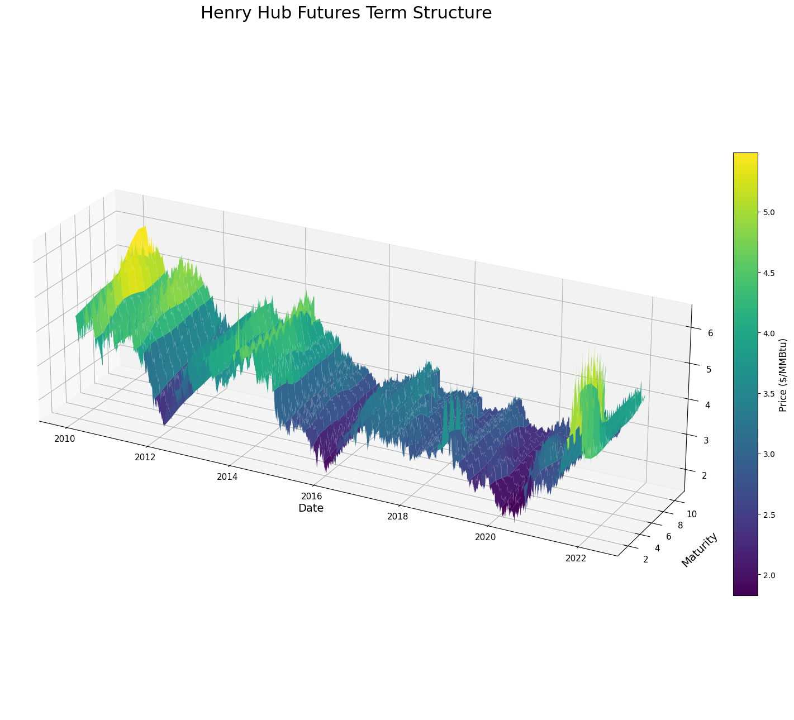

# Natural Gas Forward Curve — PCA Relative Value Strategy

**Oxford Alpha Fund, University of Oxford**  
*Project Manager: Solal Danan · Analyst: Shenghao Sun*

---

## Competition Result

**Winner — Oxford Alpha Fund Quant Pitch Competition (May 2026)**  
Placed 1st out of 4 teams. Judged by:
- Portfolio Manager, Point72
- Quantitative Risk Manager, Citi

> *Full implementation (code, notebooks, data pipeline, backtests) is in a private repository.  
> DM or email if you'd like to discuss the strategy: **solal.danan@gmail.com***

---

## What This Strategy Does

This is a **quantitative relative-value strategy** on the NYMEX Henry Hub natural gas forward curve. The core idea is simple:

> The 12 constant-maturity contracts (M1–M12) should move together most of the time, driven by shared macro factors (level, slope, curvature of the curve). When one maturity drifts away from that shared structure, it is temporarily mispriced relative to the others — and tends to revert.

We exploit those temporary dislocations. We are **not** forecasting where gas prices are going. We are forecasting **which maturities are rich or cheap relative to each other**, and trading that convergence.




## Alpha Hypothesis

Maturity-specific dislocations from the PCA-implied forward curve are partially predictable. These dislocations may become more predictable when storage constraints, weather shocks, and curve-state signals indicate stress in the natural gas market.


---

## The Core Idea in Three Steps

### 1. Decompose the curve into factors + residuals

We apply a **two-stage rolling PCA** to daily returns across M1–M12. This separates each contract's return into:

```
r(maturity, t)  =  factor-driven component  +  idiosyncratic residual ε(maturity, t)
```

The three PCA factors capture ~95% of all curve moves (level, slope, curvature). The residual `ε` is the part that is unique to one maturity — its deviation from the equilibrium curve.

### 2. Predict which residuals will mean-revert

We train an **Machine Learning model** to predict the next 5-day cumulative residual return for each maturity, using three signal families:

| Signal family | What it captures |
|---|---|
| **Storage** | EIA inventory level, seasonal z-score, surprise vs. consensus, storage regime (full/empty) |
| **Weather** | HDD/CDD, temperature anomaly, seasonal deviation from normal |
| **Curve state** | PCA factor levels, spread structure, recent residual momentum |

The key hypothesis: **residuals become more predictable under storage stress**, because the non-linear relationship between inventory constraints and forward pricing creates systematic and repeated mispricings.

### 3. Build a factor-neutral long/short portfolio

We rank maturities by predicted signal and go **long the 4 most undervalued, short the 4 most overvalued**. The portfolio is:
- **Dollar-neutral** (equal gross long and short)
- **Factor-neutral** (hedged against the 3 main PCA factors)

This means the P&L comes *only* from the idiosyncratic residual — pure relative value, no directional gas price bet.

---

## Methodology Details

### Two-Stage PCA

A standard single PCA is sensitive to high-volatility periods dominating the factor estimates. We use a two-stage approach:

- **Stage 1** — Fast exponential decay weighting to estimate per-maturity idiosyncratic volatility  
- **Stage 2** — Reweighted SVD on inverse-vol scaled returns with slower time weights

This gives more stable factor loadings and cleaner residuals across market regimes.

### Target Variable

For each maturity `i` and date `t`, the prediction target is the **standardized 5-day cumulative residual return**:

```
y_raw(i,t)  =  Σ ε(i, t+k)   for k = 1..5   (clipped at 3σ)

y_z(i,t)    =  y_raw(i,t) / (√5 · σ_ε(i,t,63))
```

where `σ_ε(i,t,63)` is the trailing 63-day standard deviation of daily residuals, computed on data up to `t` only (no lookahead).

- `y_z > 0` → maturity expected to outperform the factor-implied curve → long
- `y_z < 0` → maturity expected to underperform → short

**Why factor-neutralize the portfolio?**
The target `y_z` is a residual — the P&L of a factor-neutral portfolio equals `w · y_raw` exactly. Without factor neutralization, PnL would also depend on factor returns, which are not what we're predicting.


### ML Training — Purged Walk-Forward CV

The in-sample period (2013–2022) uses **purged walk-forward cross-validation** to select all model choices:

| Parameter | Value |
|---|---|
| Train window | 3 years rolling |
| Validation window | 3 months |
| Purge gap | 6 business days (prevents leakage from the 5-day target horizon) |
| Step | 3 months (quarterly refits) |

All hyperparameters, feature sets, and portfolio rules were locked after in-sample selection. The **out-of-sample period (Jan 2022 – Mar 2026) was not touched during development**.


## Data Sources

| Data | Source | Period |
|---|---|---|
| NYMEX Henry Hub constant-maturity futures (M1–M24) | LSEG | 2010–2026 |
| U.S. working gas in storage (weekly EIA report) | EIA | 2010–2026 |
| Population-weighted CONUS temperature (HDD/CDD) | NOAA/CPC | 2010–2026 |
| Macro controls (WTI, TTF, VIX, OVX, EUR/USD, T-Bill, S&P 500) | FRED & CBOE | 2010–2026 |

---

## Pitch Deck

The full competition presentation is included: [`HH_Relative_Value.pptx`](./HH_Relative_Value.pptx)

---

## Contact

Full codebase and implementation details are in a private repository.  
Reach out at **solal.danan@gmail.com** or on LinkedIn to discuss.

---

## References

1. G. Paleologo (2025). *The Elements of Quantitative Investing* — Ch. 7: Statistical Factor Model
2. Y. Chen (2023). Temperature, Storage and Natural Gas Futures Prices. *Journal of Futures Markets*, Wiley
3. M. Boons & M. Porras Prado (2019). Basis-Momentum. *Journal of Finance*
4. M. Lopez de Prado (2018). *Advances in Financial Machine Learning*. Wiley Finance Series
